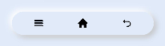

# Neumorphism_Navbar

# Installation :

Install using npm inside pages directory

```npm init -y```

```npm i hmos-neumorphism ```

# Note :

Add this css snippet when passing input or button through slot .

```css
button, input{
    width: 100%;
    height: 100%;
    background-color:transparent;
    text-color: black;
}
```

# Navbar



Import:
```html
<element name='neunavbar' src='../node_modules/hmos-neumorphism/navbar/navbar.hml'></element>
```

Usage:
```html
<neunavbar  width="300px" height="50px" border="50px" @right-event="buttonClick" @middle-event="buttonClick" @left-event="buttonClick">
  <image slot="first" src="common/icons/recent.png" style="width:20px; height: 20px;" ></image>
  <image slot="second" src="common/icons/home.png" style="width:20px; height: 20px;" ></image>
  <image slot="third" src="common/icons/return.png" style="width:20px; height: 20px;" ></image>
</neunavbar>
```

# Reference:

<a href="https://neumorphism.io/">neumorphism.io</a>

<a href="https://ismail9k.github.io/neomorphism/">ismail9k.github.io/neomorphism</a>
